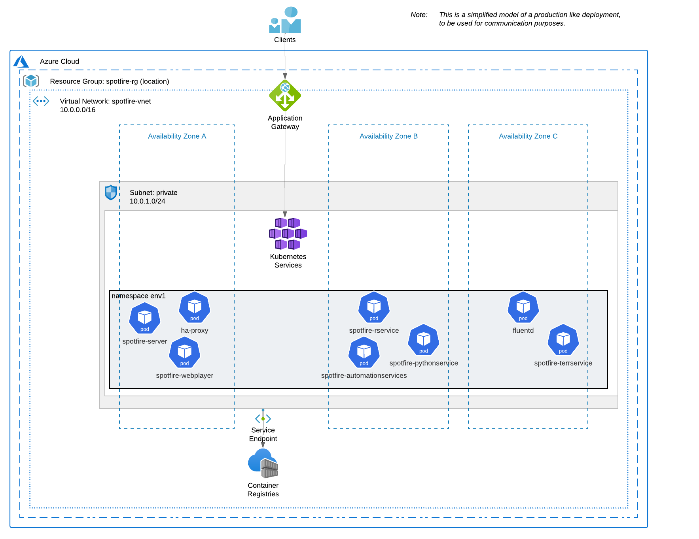

# Automatic Deployment of Spotfire Platform on Azure Kubernetes Service (AKS) using Spotfire containers images and Helm charts

## Overview

This **Spotfire QuickStart in Azure AKS** shows how to automatically deploy the [Spotfire platform](https://www.spotfire.com/) on Azure Kubernetes Service (AKS) using container images and Helm charts.

**Note**: The purpose of this quickstart example is to provide a starting point for automatic deployment of Spotfire. This quickstart is not for production usage. This quickstart example can be easily extended and customized for production usage.

**Note**: This quickstart example has been verified with Spotfire 12.5 release, but it may work for other Spotfire versions with minimal modifications.

### Which kind of Spotfire environment is deployed by this quickstart example?

This quickstart has 2 main parts:

1. Deploy the required infrastructure components (using Terraform templates):
   - Virtual Private Cloud: Azure Virtual Network.
   - Kubernetes cluster: Azure Kubernetes Service (AKS).
   - OCI registry: Azure Container Registry (ACR).
   - Load balancer: Azure Application Gateway (optional).

2. Deploy the Spotfire environment (using the Spotfire CDK) in the created infrastructure:
   - All typical services in a Spotfire platform environment, using the Spotfire container images and Helm charts

The following diagram shows the deployed environment by this **Quickstart for Spotfire in AKS**:



**Note**: This quickstart uses the [Spotfire Cloud Deployment Kit](https://github.com/spotfiresoftware/spotfire-cloud-deployment-kit/tree/main) to build and deploy the Spotfire container images and Helm charts.
For more information, see the project's documentation and examples.

**Note**: This quickstart has been customized and extended from [Provision an AKS Cluster learn guide](https://learn.hashicorp.com/terraform/kubernetes/provision-aks-cluster).
For more information and extending the example, see [https://registry.terraform.io/providers/hashicorp/azurerm/latest].

## Prerequisites

- Required **Spotfire** installation packages.
- A **Linux host** with admin permissions to build and execute the containers.
    You can use a bare metal installed server, a virtual machine, or WSL on Windows.
    In this quickstart we will refer to it as "_the launcher_".
    All the examples are using an Ubuntu server.
- You have the following installed command tools in your launcher: `make`, `terraform`, `docker`, `kubectl`, `helm`, `jq`.
- You have installed Azure CLI.
- A valid **Azure account and access credentials**.

## Usage

### Deploy an AKS cluster in Azure

For easier setup we provide a `Makefile` with commands for the  common steps.
You can read the `Makefile` for more info on the specific commands.

Steps:

1. Log in to AWS:
    ```bash
    make az-login --use-device-code
    ```

2. Copy the provided example `terraform.tfvars.example` to a new file, for example `terraform.tfvars`.
    Read and modify as needed the deployment configuration variables in the `terraform.tfvars` file.
    Read the file `variables.tf` and the other template files (`*.tf`) for more variables and usage.
    Remember that you can (and should) modify the templates included in this quickstart to adapt them to your needs.

    **Note**: You need to create an Azure Service Principal (only once). 
    You can use the provided script: `./az_create_sp.sh`

3. Init your Terraform workspace (fetch/update Terraform plugins and modules):
    ```bash
    make init
    ```

4. Plan (preview the changes Terraform will make before you apply):
    ```bash
    make plan
    ```

5. Apply (makes the changes defined by your plan to create, update, or destroy resources):
    ```bash
    make apply
    ```
   **Note**: The Terraform deployment takes around 10 min.
   Note that the resources may take some more minutes to be ready.

6. Add the AKS configuration to your kubectl config:
    ```bash
    make az-aks-cfg-kubectl
    ```

7. Show the created K8s cluster configuration:
    ```bash
    make az-aks-show
    ```

8. Log in to the created Azure Container Registry (ACR) to be able to push images:
    ```bash
    make az-acr-login
    ```

9. Set REGISTRY variable to point to the created registry:
    ```bash
    make az-registry-show
    ```
   Set the REGISTRY variable in your environment as indicated from the previous output.
   For example:
    ```bash
    export REGISTRY=spotfirequickstart.azurecr.io
    ```

### Deploy Spotfire in the created AKS cluster

Now we use the Spotfire CDK to build the Spotfire container images and Helm charts and deploy Spotfire in the created K8s cluster.

1. Change to the directory:
    ```bash
    cd ../spotfire-cdk-quickstart
    ```

2. Follow the steps in [Deploy Spotfire on a kubernetes cluster using the Spotfire CDK](../spotfire-cdk-quickstart/README.md).

### Clean up

When you are done, remember to destroy the created resources to avoid unneeded costs.
```bash
make destroy
```

### Other

See other useful commands included in the provided 'Makefile':
```bash
make
```

## What to do next

There are further ways to customize this quickstart:

- Enable SSL connections
- Add external user authorization and authentication
- Use Azure SQL as the Spotfire database
- Add a Spotfire action log database
- Use multiple regions
- etc.

Please, see the [Spotfire® Server and Environment - Installation and Administration](https://docs.tibco.com/pub/spotfire_server/latest/doc/html/TIB_sfire_server_tsas_admin_help/server/topics/getting_started.html) documentation for details on specific Spotfire administration and configuration procedures.
